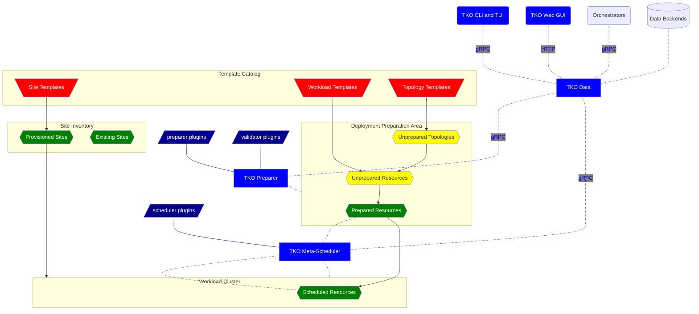

WARNING: This repository is published by the [Nephio Authors](https://nephio.org/) but is
neither endorsed nor maintained by the Nephio Technical Steering Committee (TSC). It is intended
to be used for reference only. The Nephio distribution repositories are located in the
[`nephio-project` organization](https://github.com/nephio-project). For more information
[see this page](https://nephio.org/experimental).

TKO
===

A PoC demonstrating scalability opportunities for Nephio with a focus on decoupling the various
subsystems, specifically the data backend and orchestration logic plugins, as well as integration
with external site inventories and blueprint catalogs.

This PoC is a complete rewrite of the Nephio core. It comprises three controllers (Data, Preparer,
and Meta-Scheduler) that can run independently or be embedded into a control plane. Included
is first-class support for using a Kubernetes management cluster as the control plane.

For the data backend, the default is RDBMS, optimized for the [PostgreSQL](https://www.postgresql.org/)
dialect of SQL. RDBMSes provides scalability, reliability, resiliency, and atomic updates via
transactions. They are widely available as managed cloud services, e.g. Google's planetary-scale
[Spanner](https://cloud.google.com/spanner) (which also speaks the PostgreSQL dialect).

A git data backend is also possible (a.k.a. "GitOps"), but not currently included. Note that such
a backend may be suitable for storing templates, but it's probably not a good backend for sites and
deployments, which are expected to number in the millions in real-world telco environments.

The TKO data controller exposes three flavors of API:

1) [gRPC](https://grpc.io/), which is widely supported, including in loadbalancers (see
   [Envoy](https://www.envoyproxy.io/docs/envoy/latest/intro/arch_overview/other_protocols/grpc))
   and thus service meshes. TKO makes good use of gRPC streaming directly from the backend to
   the clients, allowing scalable access to extremely large result sets.
2) KRM via a Kubernetes aggregated API. When running in a Kubernetes management cluster, it may
   be preferrable for controllers to use KRM instead of gRPC, though the latter is still readily
   available inside Kubernetes. Note that this KRM API is *not* implemented as CRs and is *not*
   stored in Kubernetes's etcd database. Rather, it's a KRM facade over the TKO backend.
3) A simple JSON-over-HTTP API for web browser applications, such as GUIs.

Ways in which TKO differs from Nephio:

* A different approach to "specialization" (here called "preparation"), replacing the
  [kpt](https://kpt.dev/) file with per-resource plugins: no pipeline, no conditions.
  Enforces atomic updates. Kpt functions still get first-class support.
* A different approach to "instantiation" based on meta-scheduling of complete sites
  together with *all* their associated workload deployments, including infrastructure
  resources for infrastructure managers. Can work with existing sites and also provision
  new ones.
* A different approach to topologies, incorporating topology decomposition as part of the
  preparation process. Topologies can be nested. Also supports
  [TOSCA](https://www.oasis-open.org/committees/tosca/) topologies as an alternative frontend,
  implemented with [Puccini](https://github.com/tliron/puccini).
* A different approach to KRM validation, supporting custom validation plugins that can
  go far beyond OpenAPIv3 schemas. Can also work on templates via "partial" validation. Invalid
  KRM is *never* allowed into the backend. Relies on
  [Kubeconform](https://github.com/yannh/kubeconform) for validating standard Kubernetes
  resources via their published OpenAPIv3 schemas.

Additional features demonstrated:

* SDK for Python-based plugins for preparation, meta-scheduling, and validation. The SDK
  does most of heavy lifting, allowing devs to focus on the network function or cloud
  platform vendor logic.
* Rich metadata support, enabling powerful and scalable package querying and template/site
  selection for topologies.
* Support for [Helm](https://helm.sh/) charts with an expression language for pulling in
  chart input values (as an alternative to full-blown preparation plugins).
* Web dashboard.
* Rich terminal dashboard, with mouse support.
* IPv6 first, with support for dual-stack IP.
* Unified structured logging via [CommonLog](https://github.com/tliron/commonlog),
  including support for logging to journald.

Documentation
-------------

* [Installation guide](INSTALL.md)
* [User guide](USAGE.md)
* [Package reference](PACKAGES.md)
* [KRM API](KRM.md)
* [How preparation works](PREPARATION.md)
* [TODO](TODO.md)

Architecture Diagram
--------------------

Additional Resources
--------------------

* [Presentation recording](https://www.youtube.com/watch?v=rYQYj84Bcec)
* [Components proposal](https://docs.google.com/drawings/d/1I7e3zm9-xC6cDxNd_ANPCVGbOQLgjAX25cImhwObG74)
  ([presentation recording](https://www.youtube.com/watch?v=nwd4t0DTTH8))
* [Nephio R2 Summit presentation slides](https://docs.google.com/presentation/d/1I54I6RvexMjcP-qJSDq3xEqCyD6rCEfU_lcAdSFy1iM)
