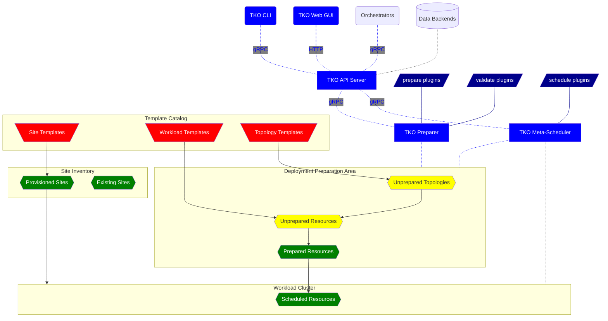

WARNING: This repository is published by the [Nephio Authors](https://nephio.org/) but is
neither endorsed nor maintained by the Nephio Technical Steering Committee (TSC). It is intended
to be used for reference only. The Nephio distribution repositories are located in the
[`nephio-project` organization](https://github.com/nephio-project). For more information
[see this page](https://nephio.org/experimental).

TKO
===

A PoC demonstrating scalability options for Nephio with a focus on decoupling the various
subsystems, specifically the data backend and API access, as well as integration with external
site inventories and blueprint catalogs.

Additional features demonstrated:

* A different approach to "specialization" (here called "preparation"), replacing the kpt
  pipeline with per-resource plugins: no pipeline, no conditions. Enforces atomic updates.
* A different approach to "instantiation" based on meta-scheduling for a complete site
  together with *all* its associated workload deployments, including infrastructure KRMs
  for infrastructure managers. Can work with existing sites and also provision new ones.
* A different approach to topologies, incorporating topology decomposition as part of the
  preparation process. Also supports TOSCA topologies as an alternative frontend,
  via [Puccini](https://github.com/tliron/puccini).
* A different approach to KRM validation, supporting custom validation plugins that go way
  beyond OpenAPIv3. Can also work on templates via "partial" validation. Invalid KRM is
  *never* allowed into the backend. Relies on
  [Kubeconform](https://github.com/yannh/kubeconform) for standard Kubernetes resources.
* SDK for Python-based plugins for preparation, meta-scheduling, and validation. The SDK
  does most of heavy lifting, allowing devs to focus on the network function or cloud platform
  vendor logic.
* Rich metadata support, enabling for powerful and scalable package querying and
  template/site selection.
* IPv6 first, with powerful support for dual-stack IP.
* Unified structured logging via [CommonLog](https://github.com/tliron/commonlog),
  including support for logging to journald.

Documentation
-------------

* [Installation guide](INSTALL.md)
* [User guide](USAGE.md)
* [Reference guide](REFERENCE.md)
* [How preparation works](PREPARATION.md)
* [TODO](TODO.md)

Architecture Diagram
--------------------

Additional Resources
--------------------

* [Components proposal](https://docs.google.com/drawings/d/1I7e3zm9-xC6cDxNd_ANPCVGbOQLgjAX25cImhwObG74)
  ([presentation recording](https://www.youtube.com/watch?v=nwd4t0DTTH8))
* [Nephio R2 Summit presentation slides](https://docs.google.com/presentation/d/1I54I6RvexMjcP-qJSDq3xEqCyD6rCEfU_lcAdSFy1iM)
